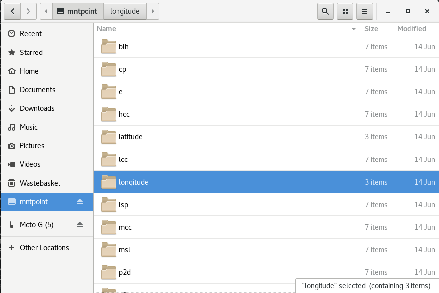
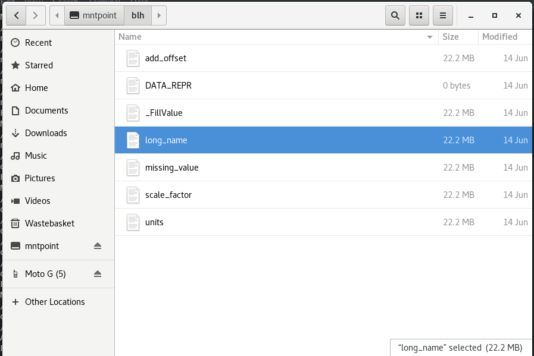

[](https://travis-ci.org/dvalters/fuse-netcdf)
[](https://www.codacy.com/app/dvalters/fuse-netcdf?utm_source=github.com&amp;utm_medium=referral&amp;utm_content=dvalters/fuse-netcdf&amp;utm_campaign=Badge_Grade)

[](https://www.python.org/downloads/release/python-360/)
[](https://www.python.org/downloads/release/python-270/)


# fuse-netcdf
ESoWC project for the netcdf-fusepy utility. (Work in progress)

_See the wiki for proposal, workplan, other notes etc. https://github.com/dvalters/fuse-netcdf/wiki_

This readme contains a brief overview of how to use fuse-netcdf and some example output.

## Usage

*Note:* At the minute the script will only mount a read only version of the netCDF file, with folders for each Variable and 'placeholder' files for Variable metadata names. These will soon contain editable variable metadata.

This is currently a work in progress, but the basic usage at the testing stage is as follows:

```bash
python fusenetcdf.py <NetCDF_File.nc> <mountpoint>
```
 - The `fusenetcdf.py` is in the `fusenetcdf` directory.

 - The `<NetCDF_File.nc>` should be the path to your netcdf file. 

 - You should create an empty folder which will be your mountpoint at `<mountpoint>`

To unmount the netCDF directory, use:

```
fusermount -u mntpoint/
```

### Example usage:

From the linux terminal:

(A sample netcdf file is provided in the `trial` folder)

```
(fusepy27) [dav@localhost fuse-netcdf]$ python fuse-netcdf/fusenetcdf.py trial/ECMWF_ERA-40_subset.nc trial/mntpoint/
```

Your netCDF file should now be mounted at `/trial/mntpoint` (Or wherever you created the mountpoint folder).

#### What does the mounted netCDF file look like? (note: this is subject to change during development)

If we run the `tree` command in the top level directory, we get a structure like this:

```
mntpoint/
├── netCDF_variable_name
│   ├── DATA_REPR        # The representation of the Variable's data array (placeholder)
│   ├── variable_attr1    # A file representing each attribute
│   ├── variable_attr2    # More attributes for this variable etc.
(and so on for each variable)
```

So to see it with the example file, we get:

```
[dav@localhost trial]$ tree mntpoint/
mntpoint/
├── blh
│   ├── add_offset
│   ├── DATA_REPR
│   ├── _FillValue
│   ├── long_name
│   ├── missing_value
│   ├── scale_factor
│   └── units
├── cp
│   ├── add_offset
│   ├── DATA_REPR
│   ├── _FillValue
│   ├── long_name
│   ├── missing_value
│   ├── scale_factor
│   └── units
├── e
│   ├── add_offset
│   ├── DATA_REPR
│   ├── _FillValue
│   ├── long_name
│   ├── missing_value
│   ├── scale_factor
│   └── units
├── hcc
│   ├── add_offset
│   ├── DATA_REPR
│   ├── _FillValue
# etc etc.....
```

If you are using a graphical file browser, the output is similar. Here is an example of what it should look like:






## Development resources

Example of the fusepy module in use here (w/o netCDF)  https://github.com/dvalters/Python-miscellany/blob/master/fusepy.ipynb

Blogpost example: https://medium.com/the-python-corner/writing-a-fuse-filesystem-in-python-5e0f2de3a813

Which is based on this example... https://github.com/skorokithakis/python-fuse-sample

fusepy is not that well documented, but these resources have been useful (they mostly refer to the FUSE C-library)

https://engineering.facile.it/blog/eng/write-filesystem-fuse/

https://www.cs.hmc.edu/~geoff/classes/hmc.cs135.201001/homework/fuse/fuse_doc.html

https://www.cs.nmsu.edu/~pfeiffer/fuse-tutorial/html/unclear.html

http://www.maastaar.net/fuse/linux/filesystem/c/2016/05/21/writing-a-simple-filesystem-using-fuse/

This is a nice overview of what happens when  various filesytem operations are called: https://www.slideshare.net/matteobertozzi/pythonfuse-pycon4
